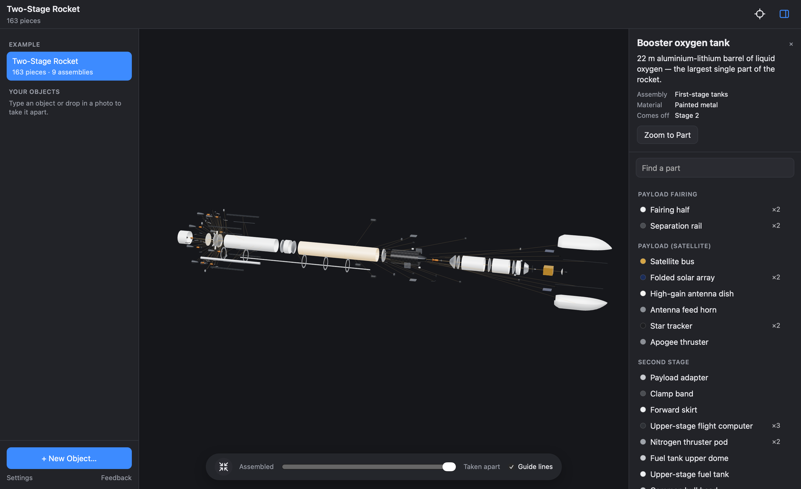

# Take It Apart

Take objects apart in 3D, part by part: orbit, zoom and click any piece to see what it is and what it does. **[Open Take It Apart](https://amalmehta.github.io/take-it-apart-site/)**

How to use it: **[docs/GUIDE.md](docs/GUIDE.md)**
